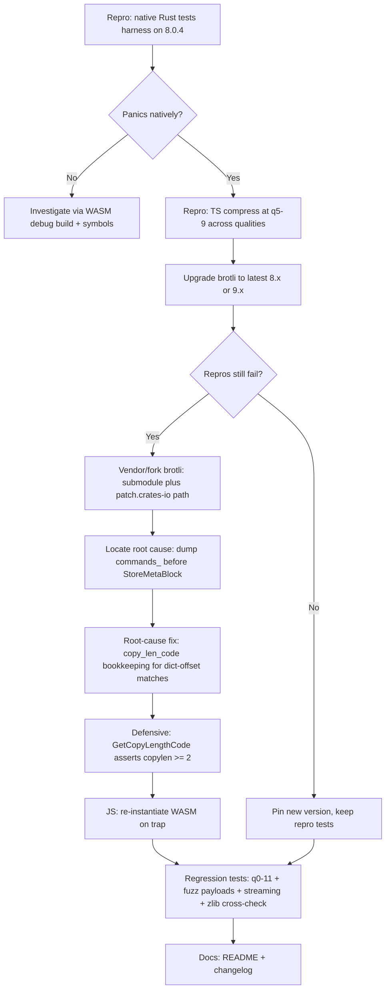

# Plan — Fix WASM encoder panic with custom dictionaries

> Goal: reproduce, verify, root-cause, fix, and lock down with regression tests the
> `compress()` panic that occurs with a `customDictionary` at qualities 5–9.
> The panic originates in the **upstream `brotli` crate (8.0.4)**, not the wrapper glue.

## Evidence summary (from fuzzing)

- `compress()` traps (`RuntimeError: unreachable` / Rust `index out of bounds`) for
  inputs with `customDictionary` at q5–q9.
- Panic site: `brotli-8.0.4/src/enc/brotli_bit_stream.rs:1940` — `GetCopyBase(copycode)`
  → `kCopyBase[copycode]`, len 24, **index 65535**.
- `copycode` = `GetCopyLengthCode(cmd.copy_len_code())` in `src/enc/command.rs:91`:
  `copylen.wrapping_sub(2) as u16` underflows for `copylen == 0|1` → 65534/65535.
- Triggered **only** on the q5–q9 path (`BrotliBuildMetaBlock` hash-chain backward
  references over the ring buffer that now includes the prepended dictionary).
- q0–q4 (fast fragment path) and q10–q11 (root meta-block builder) are unaffected.
- Decompression is unaffected (250-case fuzz, 0 mismatches).

## Minimized repro inputs

- payload (23 B): `42ringbaznumberbar 42ba`
- dict (13 B, trailing space matters): `ingr boolean `
- panics at q7/8/9 (fresh process). Wider 1001 B payload + 216 B dict panics q5–q9.

## Decisions (confirmed with user)

1. **Upgrade-first**: bump `brotli` to latest 8.x/9.x, re-run repros. Vendor/fork + patch
   only if the panic persists.
2. **Full scope**: root-cause fix + defensive `GetCopyLengthCode` guard +
   WASM-instance-poisoning fix + regression tests.

## Flow

## Phase details

### Phase 0 — Native Rust repro harness (`tests/`)

- Add `tests/repro_dictionary_panic.rs` using the `brotli` crate **directly** (no WASM),
  mirroring [`src/lib.rs`](../src/lib.rs:82) custom-dict path
  (`BrotliCompressCustomIoCustomDict`).
- Cover: minimized payload at q5–q11; the 1001 B fuzz payload at q5–q9.
- Each case round-trips through `BrotliDecompressCustomIoCustomDict` and asserts the
  bytes match. A Rust `panic!` inside a `#[test]` fails that test cleanly (no abort),
  so pre-fix these tests fail; post-fix they pass.
- The panic is a real array bounds violation → panics in **debug and release**, so native
  repro on stock 8.0.4 is expected to succeed (resolving the findings' "almost certainly"
  uncertainty). If it does **not** panic natively, fall back to branch `Z`.

### Phase 1 — WASM TS regression test (`test/brotli.spec.ts`)

- New `describe` block "Brotli-wasm custom dictionary panic regression".
- Minimized payload + dict, loop qualities 0–11, assert `compress` returns a buffer and
  round-trips via `decompress`. Pre-fix: q5–q9 throw `RuntimeError: unreachable`.
- Note: a trap poisons the WASM instance for the rest of the process (see Phase 6). Until
  the fix lands, run failing qualities in separate processes for clean diagnostics.

### Phase 2 — Upgrade attempt

- Check crates.io for the latest `brotli` (8.x / 9.x). `Cargo.toml` currently uses
  `brotli = "8"` (= `^8`, excludes 9.x). Try latest 8.x first; if a 9.x exists and 8.x is
  still broken, evaluate the breaking-change surface and bump to `"9"`.
- `cargo update -p brotli` / edit [`Cargo.toml`](../Cargo.toml:22), rebuild WASM
  (`npm run build`), re-run Phase 0 + Phase 1 repros.
- If fixed: pin the version in `Cargo.lock`, keep all repro tests, skip Phases 3–5.

### Phase 3 — Vendor/fork (only if still panicking)

- Mechanism: git submodule of the brotli-rs repo at a pinned commit under `vendor/brotli`,
  plus `[patch.crates-io] brotli = { path = "vendor/brotli" }` in the **workspace** root
  `Cargo.toml` (or a crate-level patch). Keeps builds offline/reproducible, full source
  control over the fix.
- Root-cause hunt: build the vendored crate in debug, instrument right before
  `StoreMetaBlock` / `StoreCommandExtra` to dump every `Command`'s
  `insert_len`, `copy_len`, `copy_len_code()`, `dist`. The offender has
  `copy_len_code() < 2`. Walk backwards to its creation/extension.
- Prime suspects (brotli 8.0.4):
  - `Command::init` (`src/enc/command.rs:283`): packs
    `copylen | ((copylen_code - copylen) << 25)`; a caller passing
    `copylen=2, copylen_code=1` bakes in the underflow.
  - `extend_last_command` (`src/enc/encode.rs:386`): extends `copy_len_ += 1` then
    recomputes the code from `(copy_len_ & 0x01ff_ffff) + (copy_len_ >> 25)`. Its
    `max_distance` bookkeeping when `last_processed_pos_` starts at `dict_size`
    (custom-dict path only) is the strongest candidate.

### Phase 4 — Root-cause fix

- Ensure every emitted `Command` has `copy_len_code() >= 2` on the dictionary path.
- Most likely correction: in `extend_last_command` / the q5–q9 meta-block builder, account
  for the `dict_size` offset in distance/`max_distance` comparisons so a dictionary-derived
  match is either extended consistently or emitted with a valid length code.
- Add a unit test in the vendored crate exercising the exact input.

### Phase 5 — Defensive hardening

- In the vendored crate: change `GetCopyLengthCode(copylen)` and `GetInsertLengthCode` to
  assert the brotli invariant (copylen >= 2 / insertlen >= 0) instead of `wrapping_sub(2)`.
- Debug → `assert!`; release → return the minimum valid code so a future logic bug fails
  loudly at the source rather than as a far-away index OOB.

### Phase 6 — WASM-instance-poisoning fix (JS)

- After a trap, the module instance is dead for the process. Wrap the exports in
  [`index.node.js`](../index.node.js:1), [`index.web.js`](../index.web.js:1),
  [`index.browser.js`](../index.browser.js:1) so that catching a trap (message contains
  `unreachable` / `RuntimeError`) re-runs the loader and swaps in a fresh instance.
- Node sync path re-instantiation: re-execute the wasm-pack init (lazy holder). Document as
  best-effort; the root-cause fix is the real guarantee.

### Phase 7 — Regression tests

- Expand the existing "custom dictionaries" block:
  - minimized + 1001 B fuzz payloads across **all** qualities 0–11, round-tripped.
  - deterministic light-fuzz: seeded random token payloads with derived dictionaries at
    q5–q9 (covers the previously-fragile range).
  - streaming `CompressStream` with dict at q7, round-tripped via `DecompressStream`.
  - Node-only: cross-check decoded bytes against `require('zlib').brotliDecompressSync`.

### Phase 8 — Verification

- `npm run test` → `test:node` + `test:esm` + `test:webpack`.
- Confirm the new regression tests **fail on the pre-fix build** and **pass after the fix**
  (validate by toggling the fix / the old crate version once).

### Phase 9 — Docs

- Update [`README.md`](../README.md:32) custom-dictionaries section: note q0–q11 are now
  fully supported with dictionaries, the panic is fixed, and a short changelog entry.

## Out of scope

- Decompression paths (verified correct).
- Compression **without** `customDictionary` (never affected).
- Reimplementing brotli (kept as a crate dependency; fix applied via patch).
